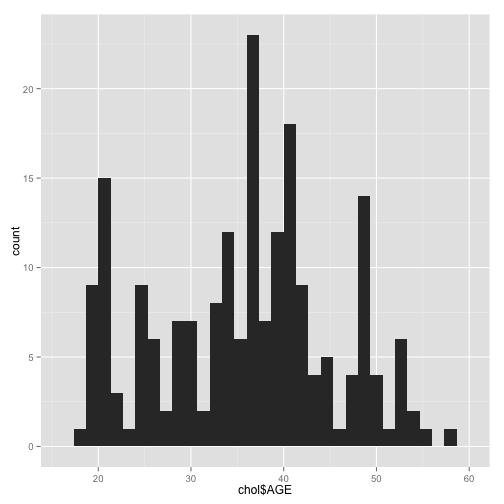

# Introduction to Data Visualization.

 

> ### What is Data Visualization?

<b>
Data visualization is the graphical representation of information and data. By using visual elements like charts, graphs, and maps, data visualization tools provide an accessible way to see and understand trends, outliers, and patterns in data.
</b>

> ### How to get started with Data Visualization?  

<b>
There are many programming that can be used to display data graphically, but the most common one is R.
You can download R and Rstudio from [here.](https://www.rstudio.com)
</b>

> ### Getting started

<b>
The first step to plot data is to read the file which contains the data. In order to read a .csv file use the following command.  

``Variable_Name <- read.csv("local/file/path/to/the/.csv/file")``  

There are several packages that can be used to plot the data such as ggplot, ggplot2, plotly, and various others.
To install a package use this command.  
``install.packages("Package_Name")``  

This command should be used ***only once per computer.***

After installing a package you need to load the package. To load the package use the following command.
``library(Package_Name)``
</b>

> ### Scatter Plot  

<b>
Scatter plot are the easiest graph to plot. In order to plot the ``data_set`` data set with 'votes' variable on Y-axis and 'rating' variable on X-axis, use the following command.

``ggplot(data = data_set) +
  geom_point(mapping = aes(x = displ, y = hwy))``

  
  

<b>
You can even plot the different variable on the scatter plot. This is called aesthetic mapping. In order to use the aesthetic function use the following line of code.
</b>

  ``ggplot(data = mpg) +
  geom_point(mapping = aes(x = displ, y = hwy, color = class))``

  
  

  The above plot uses the aesthetic mapping so that we can plot the different ``class`` of vehicles on the plot by their ``hwy`` and ``displ``.
</b>

> ## Bar Graph  

<b>
Bar plots are one of the most common way to visualize data. In order to plot a bar graph for the ``data_set`` data use the following line of code. This line of code will produce a bar plot with ``dose`` variable on the X-axis and ``disp`` variable on the Y-axis.
</b>
``ggplot(data=df, aes(x=dose, y=len)) +
  geom_bar(stat="identity")``

  
  

> ## Line Graph  

<b>
Line graphs are really useful to show a trend in a data over a time period. You can plot a line graph using the following command line.</b>

``ggplot() + geom_line(aes(y = export, x = year, colour = product),  
  data = charts, stat="identity")``

<b> 
The above line of code will plot a line graph for the ``charts`` data with X-axis having the ``year`` variable and Y-variable having the ``export`` variable with the ``product`` variable being plotted.
</b>

> ## Histogram  

<b>
The following line of code will plot a histogram with the values form the ``AGE`` column of the ``chol`` data set.

``ggplot(data=chol, aes(chol$AGE)) + geom_histogram()``

> ## Pie Chart  

<b>
Pie chart displays data in an easy-to-read pie slice format. Each slice represents a category of data and the size is proportional to the quantity it represents.
You can plot a pie chart using the following line of code.

``bar <- ggplot(data = diamonds) + geom_bar(mapping = aes(x = cut, fill = cut), show.legend = FALSE) + theme(aspect.ratio = 1) + labs(x = NULL, y = NULL)``

``bar + coord_polar()``

<b>
The above line of code will plot a pie chart using the ``diamonds`` data set and will fill each slice with the cut column.
</b>

</enter>

> ## Resources
<ul>
<li>Learn more about ggplot2 [here.](https://ggplot2.tidyverse.org)</li>
<li>Learn to plot more types of graphs [here.](https://www.r-graph-gallery.com/all-graphs/)</li>
</ul>

> Author: Palash Gujrathi
